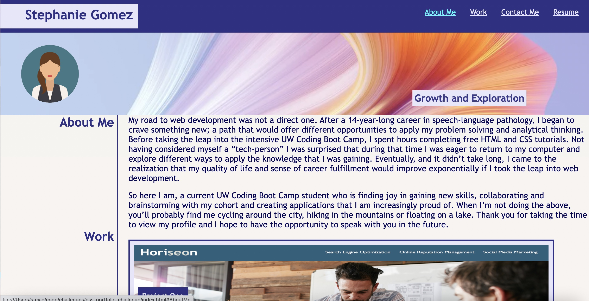

# css-portfolio-challenge

##Description:

The purpose of this project was to create a personal web developer portfolio that can be updated and refined as I deploy more applications and as my skills evolve. The profile contains a brief description of my journey into web development, links to projects and links to contact and employment information.

##Project Status: 

Deployed with the expectation of ongoing updates.

##Installation/address: 

https://smariagomez.github.io/css-portfolio-challenge/

##Known Bugs: 

Formatting/dimensions of project 1 image need to be adjusted to mitigate blurriness. 

CSS for left-sided border needs to be adjustd for more seamlsess transitions between screen sizes.

Will need to acquire a professional headshot to replace avatar.

